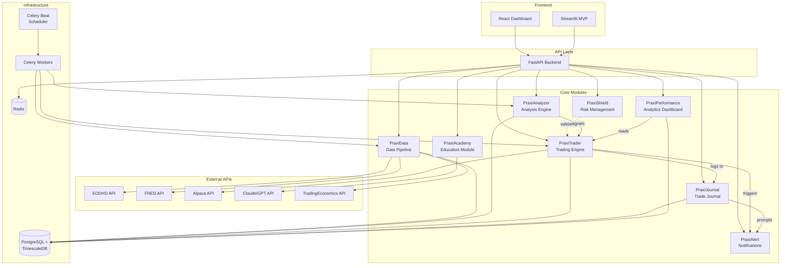
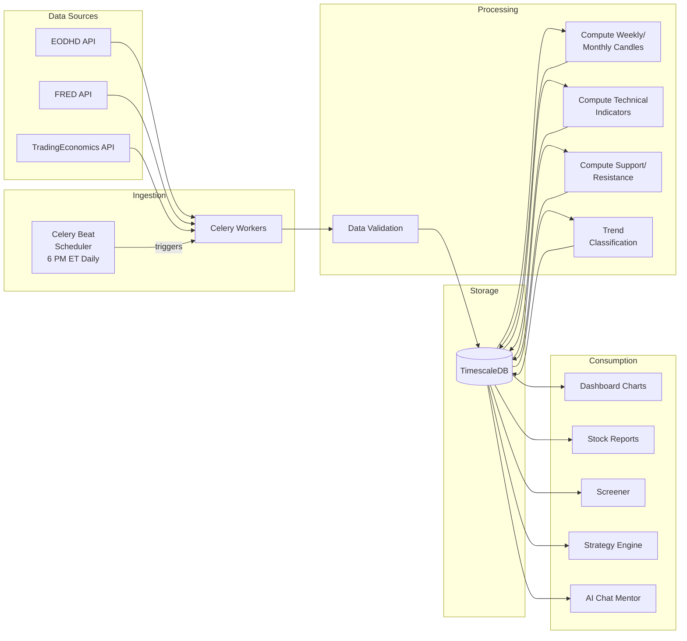
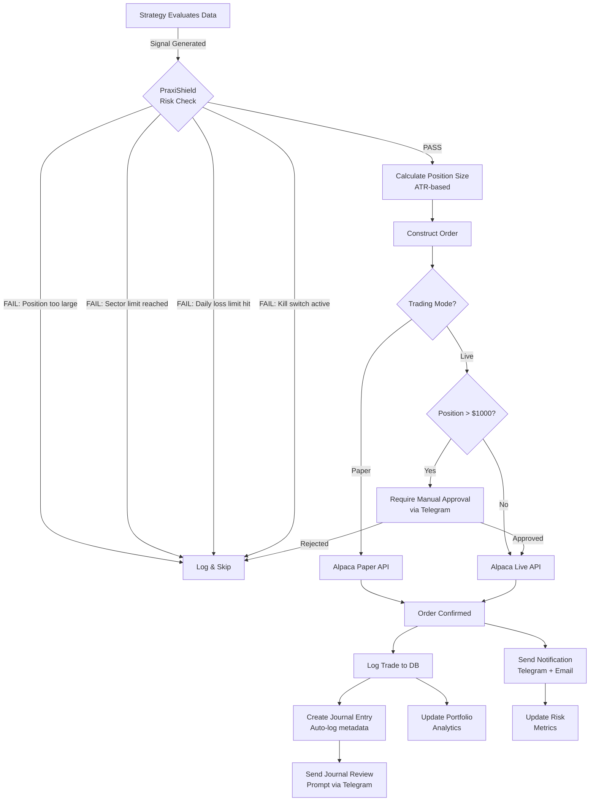
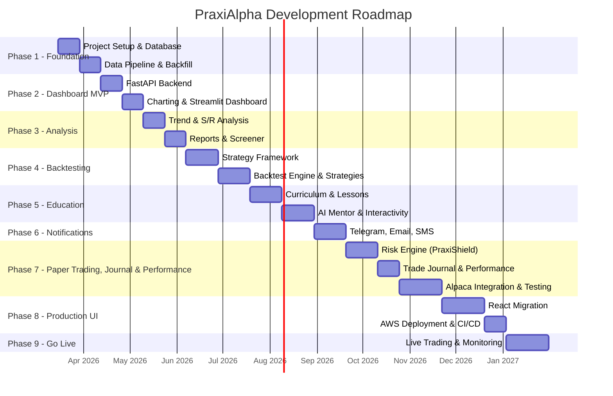

# PraxiAlpha — Design Document

> *"Disciplined action that generates alpha."*

**Version:** 1.4  
**Created:** March 12, 2026  
**Updated:** March 23, 2026  
**Author:** Adhyarth Varia  
**Status:** Draft — Finalized for Phase 1  

---

## Table of Contents

1. [Vision & Mission](#1-vision--mission)
2. [System Architecture Overview](#2-system-architecture-overview)
3. [Technology Stack](#3-technology-stack)
4. [Module Breakdown](#4-module-breakdown)
5. [Data Architecture](#5-data-architecture)
6. [Phase Roadmap](#6-phase-roadmap)
7. [API & Data Providers](#7-api--data-providers)
8. [Infrastructure & Deployment](#8-infrastructure--deployment)
9. [Budget Estimation](#9-budget-estimation)
10. [Risk Management Framework](#10-risk-management-framework)
11. [Security & Authentication](#11-security--authentication)
12. [Recommended Reading & Resources](#12-recommended-reading--resources)
13. [Open Questions & Future Considerations](#13-open-questions--future-considerations)
14. [Architecture Diagrams](#14-architecture-diagrams)

---

## 1. Vision & Mission

### Vision
Build the most empowering platform for retail investors — one that combines **investor education**, **market intelligence**, and **automated trading** into a single, cohesive system. PraxiAlpha exists to ensure retail investors **make money** and, more importantly, **don't lose money** through disciplined, systematic investing. The system embraces **simplicity over complexity** — a small number of high-conviction trades based on clear price/volume signals and institutional money flow, executed with ironclad risk management, will always outperform a high-frequency, scattered approach.

### Mission
- **Educate** new retail investors through interactive, engaging lessons rooted in real market case studies
- **Analyze** markets systematically using technical, fundamental, and macro analysis
- **Automate** trading decisions with backtested, risk-managed strategies
- **Protect** capital through robust risk management frameworks
- **Empower** users to separate emotion from execution
- **Simplify** — distill complexity into clear, actionable signals; fewer trades, bigger wins

### Core Philosophy (Mental Models)
These principles are the foundation of PraxiAlpha and will be woven into every module:

1. **Buy weakness, sell strength** — Never chase stocks in either direction
2. **Price ≠ Value** — A 50% drop can become 100%; a 100% gain can become 300%. Be deterministic about fundamentals, technicals, and macro
3. **Asynchronous cycles** — Different stocks bottom and top at different times
4. **Risk management is everything** — Survival first, profits second
5. **Discipline over emotion** — Systematic rules > gut feelings
6. **Think in probabilities** — No certainty, only edge
7. **Signal over noise** — Long-term chart patterns > daily/hourly candles
8. **Simplicity over complexity** — The best strategies are simple and repeatable. Overcomplicating a system introduces fragility. A few well-understood indicators (price, volume, key moving averages) beat a dashboard cluttered with 20 oscillators
9. **Less is more — fewer trades, bigger wins** — A strong process with high-conviction, infrequent trades vastly outperforms frequent small trades. The goal is not to trade more, but to trade *right*. Holding winners longer and being patient for the best setups is the path to outsized returns
10. **Follow the smart money** — Price/volume analysis is king. When a stock drops significantly and then prints a high-volume bullish candle, it often signals institutional/hedge fund accumulation. Buying alongside smart money — not against it — dramatically improves 6-12 month returns. The volume tells the story that price alone cannot
11. **Understand the fear/greed machine** — Wall Street manufactures narratives to create fear at bottoms and greed at tops. Nobody wants a stock at $10, but when it hits $50 it becomes the talk of the town and "everyone" wants in. By the time retail investors hear about a "hot stock," the smart money is often already selling. Recognizing this cycle — accumulation in silence, distribution in hype — is the single most valuable edge a retail investor can develop. The crowd is almost always late; your job is to act *before* the narrative, not because of it
12. **Be a contrarian with conviction** — The best trades feel uncomfortable. Buying when headlines scream doom and selling when euphoria is everywhere requires understanding that markets are driven by human psychology, not logic. Fear and greed are predictable — exploit them, don't fall victim to them
13. **The market is a discounting machine** — The stock market prices in the future, not the present. By the time any news reaches a retail investor, it is already reflected in the price. Institutional players have faster data, deeper research, and algorithmic systems that act on information before it becomes a headline. Public knowledge = no edge. Your edge comes from reading *what the smart money is doing* (price/volume), not *what the media is saying*. This mental model is the foundation of humility — it prevents you from trading on "obvious" information that the market has already digested
14. **Economic events are noise, price action is signal** — Scheduled economic releases (CPI, NFP, FOMC decisions, GDP) dominate financial media and create short-term volatility. Retail investors often panic-trade around these events, but in the grand scheme of things, they are mostly noise. The tape is set by big/smart money — institutions will do whatever they want irrespective of what the calendar says. A Fed rate decision might cause a 2% intraday swing, but the 6-12 month trend is determined by institutional accumulation and distribution patterns, not by a single data release. **Use the economic calendar as situational awareness, not as a trading signal.** Know what's coming so you're not blindsided, but never let a calendar event override your price/volume analysis. The best use of the calendar is *defensive* — avoid opening new positions right before a high-impact release, and understand why a stock might gap up or down on a given day

### Design Principle: Simplicity-First
PraxiAlpha's strategies, UI, and decision-making framework must resist the temptation of complexity. Specifically:
- **Strategies should be explainable in plain English** — if you can't describe why a trade was taken in one sentence, the strategy is too complex
- **Fewer indicators, used well** — price action, volume, and a handful of key moving averages and oscillators (RSI, MACD) are sufficient for most decisions
- **Optimize for trade quality, not quantity** — the system should generate fewer, higher-conviction signals rather than a flood of marginal ones
- **Every feature must earn its place** — if a dashboard widget, indicator, or alert doesn't directly improve decision-making, it's noise and should be removed

---

## 2. System Architecture Overview

PraxiAlpha is a **modular, cloud-hosted platform** with eight core systems:

```
┌─────────────────────────────────────────────────────────────────┐
│                        PraxiAlpha Platform                       │
├─────────────┬──────────────┬──────────────┬─────────────────────┤
│  Education  │   Market     │  Analysis &  │  Trading            │
│  Module     │   Data       │  Reporting   │  Engine             │
│             │   Pipeline   │  Engine      │                     │
├─────────────┴──────────────┴──────────────┴─────────────────────┤
│         Trade Journal & Performance Analytics Layer              │
├─────────────────────────────────────────────────────────────────┤
│                     Risk Management Layer                        │
├─────────────────────────────────────────────────────────────────┤
│              Notification & Alerting System                      │
├─────────────────────────────────────────────────────────────────┤
│          Database  │  API Layer (FastAPI)  │  Frontend (React)   │
└─────────────────────────────────────────────────────────────────┘
```

---

## 3. Technology Stack

### Backend
| Component | Technology | Rationale |
|-----------|-----------|-----------|
| **Language** | Python 3.11+ | Your primary language, rich ecosystem for finance |
| **API Framework** | FastAPI | Modern, async, auto-docs (Swagger), excellent performance |
| **Task Queue** | Celery + Redis | Async job processing (data fetching, backtesting, report generation) |
| **Scheduler** | APScheduler or Celery Beat | Scheduled tasks (end-of-day data fetch, strategy evaluation) |

### Frontend
| Component | Technology | Rationale |
|-----------|-----------|-----------|
| **MVP/Prototyping** | Streamlit | Rapid prototyping, Python-native, great for data dashboards |
| **Production** | React + TypeScript + TailwindCSS | Modern, scalable, beautiful UI for the education platform |
| **Charting** | Lightweight Charts (TradingView) + Plotly | Professional-grade interactive financial charts |

### Database
| Component | Technology | Rationale |
|-----------|-----------|-----------|
| **Primary DB** | PostgreSQL | Battle-tested, ACID compliant, excellent for relational data |
| **Time-Series Extension** | TimescaleDB | Purpose-built for time-series (OHLCV data), sits on top of PostgreSQL |
| **Cache** | Redis | Fast in-memory cache for session data, real-time state |

### Infrastructure
| Component | Technology | Rationale |
|-----------|-----------|-----------|
| **Cloud Provider** | AWS | Your existing familiarity, mature ecosystem |
| **Containerization** | Docker + Docker Compose | Consistent environments, easy deployment |
| **Orchestration** | AWS ECS (Fargate) | Serverless container hosting, no server management |
| **CI/CD** | GitHub Actions | Integrated with your GitHub workflow |
| **Monitoring** | CloudWatch + Sentry | Error tracking and infrastructure monitoring |

### AI/ML
| Component | Technology | Rationale |
|-----------|-----------|-----------|
| **AI Chat Mentor** | OpenAI GPT-4 API or Anthropic Claude API | Powers the interactive chat-based mentor |
| **Text-to-Speech** | ElevenLabs API (optional) | For narrated educational content |
| **Pattern Recognition** | Custom Python (TA-Lib, pandas) | Technical pattern detection |

---

## 4. Module Breakdown

### Module 1: Education Platform ("PraxiAcademy")

The interactive learning hub for retail investors.

#### 1A: Mental Models & Philosophy
- Interactive lesson cards with embedded charts
- Each mental model illustrated with **2-3 real historical case studies**
- Example: "Never chase a falling stock" → Show case study of a stock that dropped 50%, then another 50% (e.g., Meta 2022, Peloton 2021-2022)
- Quiz/challenge at end of each lesson

#### 1B: Technical Analysis Curriculum
| Topic | Subtopics |
|-------|----------|
| **Price/Volume Analysis** | Volume confirmation, divergences, climax volume |
| **Candlestick Patterns** | Hammer, Doji, Engulfing, Morning/Evening Star, Shooting Star, Hanging Man, Marubozu, Spinning Top, Three White Soldiers, Three Black Crows |
| **Chart Patterns** | Ascending/Descending Triangle, Falling/Rising Wedge, Head & Shoulders (and inverse), Double Top/Bottom, Cup & Handle, Bull/Bear Flag, Pennant |
| **Indicators** | RSI, MACD, Moving Averages (SMA, EMA), Bollinger Bands, Stochastic, VWAP, OBV |
| **Support & Resistance** | Horizontal levels, trendlines, Fibonacci retracements, moving average as dynamic S/R |

#### 1C: Fundamental Analysis Curriculum
| Topic | Metrics |
|-------|---------|
| **Valuation** | P/E, P/FCF, PEG, P/S, EV/EBITDA |
| **Profitability** | Gross Margin, Operating Margin, Net Margin, ROE, ROIC |
| **Growth** | Revenue Growth, EPS Growth, FCF Growth |
| **Health** | Debt/Equity, Current Ratio, Interest Coverage |

#### 1D: Macro Analysis Curriculum
| Topic | What to Track |
|-------|-------------|
| **Global Liquidity** | Central bank balance sheets, M2 money supply |
| **Bond Markets** | US 10Y/2Y yields, yield curve, global bond yields |
| **Currencies** | DXY (Dollar Index), EUR/USD, USD/JPY |
| **Commodities** | Oil (WTI/Brent), Copper |
| **Inflation** | CPI, PCE, 10-Year Breakeven Inflation Rate |
| **Volatility** | VIX, VIX term structure, MOVE Index |
| **Intermarket Analysis** | Correlations between above and equity markets |

#### 1E: Investor & Trader Psychology Curriculum
| Topic | What to Teach |
|-------|-------------|
| **The Market is a Discounting Machine** | The stock market prices in future expectations, not current reality. By the time a retail investor reads a headline — earnings beat, FDA approval, tariff news, Fed decision — institutional investors, hedge funds, and algorithmic systems have already positioned. The "news" is priced in *before* it's news. This is why stocks often "sell the news" after a positive earnings report — the smart money bought weeks ago on the *expectation* and is now selling into retail excitement. Case studies: stocks that rallied before good news was public (institutional front-running via superior research, channel checks, and data feeds), and stocks that tanked *before* bad news hit mainstream media. This directly connects to the Fear/Greed Machine — Wall Street uses the *narrative* around already-priced-in events to manufacture panic or euphoria, triggering retail to buy high and sell low. The takeaway: if your edge is based on publicly available information that everyone already knows, you have no edge. PraxiAlpha's edge is in *price/volume behavior* — which reveals what the smart money is actually *doing*, not what the media is *saying* |
| **The Fear/Greed Cycle** | How Wall Street manufactures narratives — accumulation happens in silence, distribution happens in hype. Case studies: nobody wanted AAPL at $90 in 2016 but everyone wanted it at $180; nobody wanted META at $90 in Nov 2022 but everyone wanted it at $500+ |
| **The Retail Trap** | By the time a stock is on CNBC/social media and "everyone" is talking about it, the smart money is distributing. Recognizing the signs of late-stage euphoria vs. early-stage accumulation |
| **Anchoring Bias** | "It was $300 so $150 must be cheap" — price anchoring leads to buying without understanding why a stock dropped. The correct anchor is business fundamentals, not past price |
| **Loss Aversion & Disposition Effect** | Why investors sell winners too early (fear of losing gains) and hold losers too long (refusing to accept a loss). This is the #1 behavioral mistake retail investors make |
| **Recency Bias** | Assuming recent trends will continue forever — leads to buying high in euphoria and selling low in panic |
| **FOMO (Fear of Missing Out)** | The psychological pressure to buy a parabolic stock because "it might go higher" — and why this almost always ends badly |
| **Confirmation Bias** | Seeking only information that supports your existing position. PraxiAlpha's system combats this by forcing you to check all three pillars (technical, fundamental, macro) regardless of your gut feeling |
| **The Emotional Cycle of Investing** | Optimism → Excitement → Thrill → Euphoria (max risk) → Anxiety → Denial → Fear → Panic → Capitulation (max opportunity) → Despondency → Depression → Hope → Relief. Map this to real market cycles |
| **How Wall Street Operates** | Analyst upgrades/downgrades, price targets, media narratives — understanding that these often serve institutional interests, not retail |
| **Building Emotional Resilience** | Practical techniques: journaling trades, pre-defined rules, removing price alerts during market hours, weekly review instead of daily P&L checking |

#### 1F: Options Education
| Topic | Subtopics |
|-------|----------|
| **Basics** | Calls, Puts, Strike, Expiration, ITM/OTM/ATM |
| **Greeks** | Delta, Gamma, Theta, Vega, Rho |
| **Income Strategies** | Covered Calls, Cash-Secured Puts, The Wheel Strategy |
| **Hedging** | Protective Puts, VIX Calls, Sector ETF Puts (e.g., SMH puts to hedge NVDA) |
| **Risk Warnings** | Case studies of options losses, importance of position sizing |

#### 1G: Delivery Methods
1. **Interactive Tutorials (Duolingo-style)** — Read concept → interact with chart → identify pattern → get feedback → earn progress
2. **AI Chat Mentor** — Ask questions, get explanations with pulled-up charts and examples, trained on PraxiAlpha's mental models
3. **Guided Case Studies** — Step-by-step historical walkthroughs with interactive charts
4. **AI-Narrated Slideshows** — (Phase 2) ElevenLabs narration over animated chart sequences

---

### Module 2: Market Data Pipeline ("PraxiData")

Automated data ingestion, storage, and maintenance.

#### Data Universe
- **All active US stocks** across NYSE, NASDAQ, AMEX (~7,000+ tickers)
- **All US-listed ETFs** (~2,500+)
- **Historical/delisted stocks** (added in Phase 4 for survivorship-bias-free backtesting)
- **Total universe:** ~10,000+ active tickers, expanding to ~15,000-20,000 with delisted

#### Data Types
| Data Type | Source | Frequency | History |
|-----------|--------|-----------|---------|
| **OHLCV (Daily)** | EODHD | End-of-day | 30+ years (earliest available per ticker) |
| **OHLCV (Weekly/Monthly)** | Derived from daily | Computed | 30+ years |
| **Company Fundamentals** | EODHD (upgrade to All-In-One) | Quarterly | 10+ years (major US from 1985) |
| **Macro Data** | FRED API (Federal Reserve) | Varies | 30+ years |
| **VIX / Volatility** | EODHD + FRED | Daily | 30+ years |
| **Commodities** | EODHD + FRED | Daily | 30+ years |
| **Currency Pairs** | EODHD | Daily | 30+ years |
| **Bond Yields** | FRED API | Daily | 30+ years |
| **Dividends & Splits** | EODHD | As-issued | Full history |
| **Stock Screener Data** | EODHD + computed | Daily | Current |
| **Economic Calendar** | TradingEconomics API | Near real-time | Current + 7-day lookahead |

> **Data Provider Strategy:** Start with EODHD EOD Historical Data plan ($19.99/mo) for Phase 1-2 (daily OHLCV only). Upgrade to EODHD All-In-One ($99.99/mo) when fundamentals and intraday data are needed (Phase 3+). FRED API (free) supplements macro data regardless of plan. TradingEconomics (free developer tier) provides the economic calendar for situational awareness.

#### Pipeline Architecture
```
[Scheduler (Daily 6 PM ET)]
        │
        ▼
[Data Fetcher Workers (Celery)]
        │
        ├── EODHD API → OHLCV, Dividends, Splits
        ├── EODHD API → Fundamentals (when on All-In-One plan)
        ├── FRED API → Macro indicators (yields, VIX, DXY, commodities)
        ├── TradingEconomics API → Economic calendar (upcoming events)
        │
        ▼
[Data Validation & Cleaning]
        │
        ▼
[TimescaleDB Storage]
        │
        ▼
[Derived Computations]
        ├── Weekly/Monthly candles
        ├── Technical indicators (RSI, MACD, MAs)
        ├── Support/Resistance levels
        └── Trend classifications
```

#### Backfill Strategy (Phase 1)
```
Step 1: Fetch all active US tickers from EODHD → populate stocks table
Step 2: Backfill 5-10 test stocks → validate pipeline end-to-end
Step 3: Backfill ALL active US stocks + ETFs (~10,000 tickers) → full history
Step 4: Set up daily auto-update scheduler → keeps database current
Step 5: (Phase 4) Backfill delisted stocks → survivorship-bias-free backtesting
```

---

### Module 3: Analysis & Reporting Engine ("PraxiAnalyzer")

#### 3A: Trend Analysis
For any given stock, automatically classify:

| Timeframe | Chart Used | Classification |
|-----------|-----------|---------------|
| **Short-term** | Daily chart (20-50 day patterns) | Bullish / Bearish / Neutral / Transitioning |
| **Mid-term** | Weekly chart (3-6 month patterns) | Bullish / Bearish / Neutral / Transitioning |
| **Long-term** | Monthly chart (1-5 year patterns) | Bullish / Bearish / Neutral / Transitioning |

Trend determined by:
- Moving average alignment (20/50/100/200 SMA/EMA)
- Higher highs & higher lows (or opposite)
- Key chart pattern identification
- RSI/MACD positioning

#### 3B: Support & Resistance Detection
Algorithmic detection of top 5 support and resistance levels using:
- Historical pivot points (price memory)
- Volume profile (high-volume nodes)
- Fibonacci retracement levels
- Moving average confluence zones
- Round number psychology levels

#### 3C: Stock Reports
Auto-generated reports for any stock in the database:

```
╔══════════════════════════════════════════╗
║         PRAXIALPHA STOCK REPORT          ║
║              NVDA — NVIDIA               ║
║           Generated: 2026-03-12          ║
╠══════════════════════════════════════════╣
║ TREND ANALYSIS                           ║
║   Short-term (Daily):  Bullish ▲         ║
║   Mid-term (Weekly):   Bullish ▲         ║
║   Long-term (Monthly): Bullish ▲         ║
╠══════════════════════════════════════════╣
║ KEY LEVELS                               ║
║   Resistance: $950, $920, $900, $880,$860║
║   Support:    $800, $780, $750, $700,$650║
╠══════════════════════════════════════════╣
║ VALUATION SNAPSHOT                       ║
║   P/E: 35.2  |  P/FCF: 42.1  |  PEG: 1.8║
║   P/S: 28.5  |  Gross Margin: 75.2%     ║
║   Revenue Growth (YoY): +122%            ║
╠══════════════════════════════════════════╣
║ TECHNICAL INDICATORS                     ║
║   RSI(14): 62  |  MACD: Bullish Cross    ║
║   Above 50/100/200 SMA: ✅ ✅ ✅          ║
╠══════════════════════════════════════════╣
║ MACRO CONTEXT                            ║
║   VIX: 15.2 (Low vol environment)        ║
║   10Y Yield: 4.1% (Stable)              ║
║   DXY: 103.5 (Neutral)                  ║
╚══════════════════════════════════════════╝
```

#### 3D: Candlestick Chart Generation
Interactive charts with toggleable overlays:
- OHLCV candlesticks (daily/weekly/monthly toggle)
- Volume bars with color coding
- RSI subplot
- MACD subplot
- Moving averages (20/50/100/200 SMA & EMA)
- Bollinger Bands
- Support/Resistance lines
- Fibonacci retracement overlay

#### 3E: Stock Screener
Scan the entire database for stocks matching criteria:

```python
# Example screener query
screener.find(
    rsi_14__lt=30,                    # Oversold
    price__above_sma_200=True,        # Still in long-term uptrend
    pe_ratio__lt=20,                  # Reasonably valued
    revenue_growth_yoy__gt=0.15,      # Growing 15%+
    sector="Technology"
)
```

---

### Module 4: Trading Engine ("PraxiTrader")

#### 4A: Strategy Framework
A pluggable strategy system where each strategy is a Python class:

```python
class Strategy(ABC):
    @abstractmethod
    def generate_signals(self, data: DataFrame) -> List[Signal]:
        """Analyze data and return buy/sell signals"""
        pass
    
    @abstractmethod
    def backtest(self, historical_data: DataFrame) -> BacktestResult:
        """Run strategy against historical data"""
        pass
    
    @abstractmethod  
    def risk_check(self, signal: Signal, portfolio: Portfolio) -> bool:
        """Validate signal against risk management rules"""
        pass
```

#### 4B: Example Strategy Types
| Strategy | Type | Trigger | Conviction |
|----------|------|---------|------------|
| **Institutional Accumulation** ⭐ | Technical (Price/Volume) | Stock drops significantly → high-volume bullish candle (2x+ avg volume) → signals hedge fund/institutional buying. Hold 6-12 months. | High |
| **Mean Reversion RSI** | Technical | RSI < 30 + above 200 SMA + volume spike | Medium |
| **Golden Cross** | Technical | 50 SMA crosses above 200 SMA | Medium |
| **Breakout** | Technical | Price breaks above resistance with volume | Medium |
| **Value + Momentum** | Fundamental + Technical | Low P/FCF + RSI turning up from oversold | High |
| **Macro Regime** | Macro | VIX term structure shift + yield curve change | High |
| **Sector Rotation** | Multi-factor | Relative strength between sectors | Medium |

> **Note:** The Institutional Accumulation strategy embodies PraxiAlpha's core thesis — follow the smart money via price/volume analysis. This will be the first strategy built and backtested, and will serve as the benchmark for strategy quality. Strategies should be few but high-conviction.

#### 4C: Backtesting Engine
- Walk-forward backtesting (not just in-sample)
- Transaction cost modeling (commissions, slippage, spread)
- Performance metrics: Sharpe Ratio, Sortino Ratio, Max Drawdown, Win Rate, Profit Factor, CAGR
- Visual equity curve and drawdown charts
- Monte Carlo simulation for robustness testing

#### 4D: Execution Pipeline
```
[Strategy Signal Generated]
        │
        ▼
[Risk Management Check] ──── FAIL ──→ [Log & Skip]
        │
      PASS
        │
        ▼
[Position Sizing Calculation]
        │
        ▼
[Order Construction]
        │
        ▼
[Alpaca API Execution]
        │
        ├── Paper Trading Mode → Paper account
        └── Live Trading Mode → Live account (with confirmation if configured)
        │
        ▼
[Order Confirmation & Logging]
        │
        ▼
[Trade Journal Entry Created (Auto)]
        │
        ▼
[Notification Sent + Journal Review Prompt]
```

#### 4E: Trade Journal ("PraxiJournal")
A structured trade journal that combines **automated logging** with **human reflection** — the single most effective tool for improving as a trader.

##### Auto-Logged Fields (System-Generated)
Every trade (entry and exit) automatically captures:
| Field | Source | Example |
|-------|--------|---------|
| **Trade ID** | System | `TJ-2026-0342` |
| **Ticker** | Order | `NVDA` |
| **Direction** | Order | Long / Short |
| **Strategy** | Strategy engine | `Institutional Accumulation` |
| **Entry/Exit Price** | Alpaca | $142.50 / $168.30 |
| **Position Size** | Position sizer | 50 shares ($7,125) |
| **Stop-Loss Level** | Risk manager | $131.00 |
| **Risk/Reward at Entry** | Computed | 1:2.8 |
| **Technical Setup** | Analysis engine | RSI: 28, MACD: Bearish→Bullish cross, Volume: 2.3x avg |
| **Trend Context** | Trend analyzer | Daily: Bearish, Weekly: Neutral, Monthly: Bullish |
| **Macro Context** | Macro data | VIX: 22.4, 10Y: 4.1%, DXY: 103.2 |
| **Market Regime** | Regime classifier | `Risk-On` / `Risk-Off` / `Transitioning` / `Choppy` |
| **Sector** | Stock metadata | Technology |
| **Conviction Level** | Strategy config | High / Medium / Low |
| **Timestamp** | System | 2026-03-15 10:32:14 ET |
| **P&L (realized)** | Computed on exit | +$1,290 (+18.1%) |
| **Holding Period** | Computed | 34 days |
| **Max Favorable Excursion** | Computed | +22.3% (peak unrealized gain) |
| **Max Adverse Excursion** | Computed | -4.2% (deepest unrealized loss) |

##### User-Prompted Fields (Human Reflection)
After every trade entry and exit, the system sends a **notification prompt** (Telegram/Email) asking the user to reflect and add notes:

**On Entry — Prompted questions:**
- Why does this trade make sense to you beyond the strategy signal?
- What would make you wrong? (Pre-mortem)
- Emotional state: Confident / Neutral / Uneasy / FOMO-driven?
- Anything the system might be missing? (News, earnings date, sector headwinds)

**On Exit — Prompted questions:**
- Did this trade play out as expected? Why or why not?
- What did you learn from this trade?
- Would you take this same setup again?
- Grade this trade: A (perfect execution) / B (good) / C (okay) / D (mistakes made) / F (should not have taken)

##### Journal Features
- **Full-text search** across all journal entries
- **Tag system** — user can add custom tags (e.g., `#earnings-play`, `#sector-rotation`, `#high-conviction`)
- **Attachment support** — screenshot charts at entry/exit (auto-captured)
- **Weekly review summary** — auto-generated digest of the week's trades with aggregate stats
- **Monthly review prompt** — system prompts user to write a monthly reflection reviewing patterns in their journaling
- **Export** — CSV/PDF export for tax records or personal review

> **Why this matters:** Research consistently shows that traders who journal improve significantly faster. The auto-logging removes the friction of manual data entry (which kills most journaling habits), while the reflection prompts build the self-awareness muscle that separates good traders from great ones.

#### 4F: Performance Analytics Dashboard ("PraxiPerformance")
A comprehensive analytics layer that lets you slice, dice, and analyze every aspect of trading performance. This replaces the need for multiple paper trading accounts — instead, rich metadata on every trade enables powerful filtering and comparison.

##### Core Analytics Views
| View | What It Shows |
|------|-------------|
| **Equity Curve** | Portfolio value over time with drawdown overlay, benchmark comparison (SPY) |
| **P&L Summary** | Total P&L, realized/unrealized, daily/weekly/monthly/yearly breakdown |
| **Strategy Comparison** | Side-by-side performance of each strategy: Sharpe, Sortino, win rate, avg win/loss, profit factor, max drawdown |
| **Long vs. Short Analysis** | Performance split by direction — which side is more profitable, in what conditions |
| **Market Regime Analysis** | Performance bucketed by market regime (Risk-On, Risk-Off, Choppy, Transitioning) — which strategies thrive in which environments |
| **Sector Performance** | P&L by sector — where are you making/losing money |
| **Time Analysis** | Performance by day of week, month, holding period — are there temporal patterns |
| **Risk Metrics** | VaR, Sharpe, Sortino, Calmar ratio, max drawdown, recovery time, risk-adjusted returns |
| **Trade Distribution** | Histogram of trade returns, win/loss streaks, consecutive winners/losers |
| **Journal Insights** | Correlation between self-graded trade quality (A/B/C/D/F) and actual P&L — do your "gut feelings" match reality? |

##### Filtering & Segmentation
Every analytics view can be filtered by:
- **Strategy** — e.g., show only `Institutional Accumulation` trades
- **Direction** — Long only, Short only, or Both
- **Market Regime** — Risk-On, Risk-Off, Transitioning, Choppy
- **Sector** — Technology, Healthcare, Financials, etc.
- **Date Range** — custom period, this week, this month, this quarter, YTD, all-time
- **Conviction Level** — High, Medium, Low
- **Outcome** — Winners only, Losers only, Breakeven
- **Holding Period** — Intraday, 1-7 days, 1-4 weeks, 1-3 months, 3+ months
- **Tags** — user-defined journal tags

##### Key Questions This Dashboard Answers
1. *"Which strategy performs best in a risk-off environment?"*
2. *"Am I better at long or short trades?"*
3. *"Does my institutional accumulation strategy work better in tech or healthcare?"*
4. *"What's my average holding period for winners vs. losers?"*
5. *"Do my high-conviction trades actually outperform my medium-conviction ones?"*
6. *"What's my win rate when VIX is above 25 vs. below 15?"*
7. *"Am I improving over time? (Monthly rolling Sharpe ratio trend)"*

> **Design Decision:** Single paper trading account with rich trade metadata and a powerful analytics dashboard is superior to multiple accounts. It's simpler to operate, easier to maintain, and provides *deeper* insights through cross-cutting analysis that multiple accounts can never achieve.

---

### Module 5: Risk Management Layer ("PraxiShield")

This layer sits **between every signal and every trade execution**. No trade bypasses it.

#### Position-Level Rules
| Rule | Default | Configurable |
|------|---------|-------------|
| Max position size (% of portfolio) | 5% | ✅ |
| Stop-loss (below entry) | 7% or below nearest support | ✅ |
| Trailing stop-loss | 15% from peak | ✅ |
| Take profit (partial) | 20% gain → sell 25% of position | ✅ |
| Max holding period (for swing trades) | 30 days | ✅ |

#### Portfolio-Level Rules
| Rule | Default | Configurable |
|------|---------|-------------|
| Max single sector exposure | 30% | ✅ |
| Max total invested (vs cash) | 80% | ✅ |
| Max correlated positions | 3 stocks with correlation > 0.8 | ✅ |
| Daily loss limit | 2% of portfolio | ✅ |
| Weekly loss limit | 5% of portfolio | ✅ |
| Max drawdown kill switch | 15% from peak → halt all trading | ✅ |
| Min cash reserve | 20% of portfolio always in cash | ✅ |

#### Risk Dashboard
- Real-time portfolio heat map (by sector, by position size)
- Correlation matrix of current holdings
- Value at Risk (VaR) calculation
- Maximum drawdown tracker with visual chart
- Risk-adjusted return metrics

---

### Module 6: Notification System ("PraxiAlert")

#### Notification Triggers
| Event | Urgency | Channel |
|-------|---------|---------|
| Strategy signal generated | High | Telegram + Email |
| Trade executed | High | Telegram + Email |
| **Journal entry prompt (on trade entry)** | **Medium** | **Telegram** |
| **Journal entry prompt (on trade exit)** | **Medium** | **Telegram** |
| Stop-loss triggered | Critical | Telegram + Email + SMS |
| Kill switch activated | Critical | Telegram + Email + SMS |
| Daily portfolio summary | Low | Email |
| New stock screener match | Medium | Telegram |
| Price alert hit | Medium | Telegram |
| Weekly performance report | Low | Email |
| **Weekly trade journal review** | **Low** | **Email** |
| **Monthly reflection prompt** | **Low** | **Email + Telegram** |

#### Technology
| Channel | Technology | Cost |
|---------|-----------|------|
| **Telegram** | Telegram Bot API | Free |
| **Email** | AWS SES (Simple Email Service) | ~$0.10 per 1000 emails |
| **SMS** | AWS SNS or Twilio | ~$0.0075 per SMS |

---

## 5. Data Architecture

### Database Schema (Simplified)

```
┌──────────────────┐     ┌──────────────────┐     ┌──────────────────┐
│     stocks       │     │   daily_ohlcv    │     │  fundamentals    │
├──────────────────┤     ├──────────────────┤     ├──────────────────┤
│ id (PK)          │────<│ stock_id (FK)    │     │ stock_id (FK)    │
│ ticker           │     │ date             │     │ report_date      │
│ name             │     │ open             │     │ pe_ratio         │
│ sector           │     │ high             │     │ ps_ratio         │
│ industry         │     │ low              │     │ pfcf_ratio       │
│ market_cap       │     │ close            │     │ peg_ratio        │
│ exchange         │     │ volume           │     │ gross_margin     │
│ is_active        │     │ adj_close        │     │ operating_margin │
│ added_date       │     └──────────────────┘     │ net_margin       │
└──────────────────┘                               │ revenue          │
                                                   │ revenue_growth   │
┌──────────────────┐     ┌──────────────────┐     │ eps              │
│  macro_data      │     │   strategies     │     │ fcf              │
├──────────────────┤     ├──────────────────┤     │ debt_equity      │
│ indicator_name   │     │ id (PK)          │     └──────────────────┘
│ date             │     │ name             │
│ value            │     │ description      │     ┌──────────────────┐
│ source           │     │ is_active        │     │    trades        │
└──────────────────┘     │ parameters (JSON)│     ├──────────────────┤
                         │ backtest_results │     │ id (PK)          │
┌──────────────────┐     └──────────────────┘     │ stock_id (FK)    │
│ economic_calendar│
├──────────────────┤
│ id (PK)          │
│ calendar_id (UQ) │
│ date             │
│ country          │
│ category         │
│ event            │
│ actual           │
│ previous         │
│ forecast         │
│ te_forecast      │
│ importance (1-3) │
│ source           │
│ source_url       │
│ currency         │
│ unit             │
│ ticker           │
│ last_update      │
│ fetched_at       │
└──────────────────┘
┌──────────────────┐     ┌──────────────────┐     ┌──────────────────┐
│   watchlists     │     │     alerts       │     │     trades       │
├──────────────────┤     ├──────────────────┤     ├──────────────────┤
│ id (PK, UUID)    │     │ id (PK)          │     │ id (PK, UUID)    │
│ user_id (FK)     │     │ stock_id (FK)    │     │ user_id (IDX)    │
│ name             │     │ condition        │     │ ticker           │
│ created_at       │     │ is_triggered     │     │ direction        │
│ updated_at       │     │ created_date     │     │  (long/short)    │
└──────────────────┘     └──────────────────┘     │ asset_type       │
                                                   │  (shares/options)│
                                                   │ trade_type       │
┌──────────────────┐                               │  (single_leg/   │
│ watchlist_items  │                               │   multi_leg)     │
├──────────────────┤                               │ timeframe        │
│ id (PK, UUID)    │                               │  (daily/weekly/  │
│ watchlist_id(FK) │                               │  monthly/        │
│ ticker           │                               │  quarterly)      │
│ added_at         │                               │ status (computed)│
│ notes            │                               │  (open/partial/  │
└──────────────────┘                               │   closed)        │
                                                   │ entry_date       │
                                                   │ entry_price      │
                                                   │ total_quantity   │
                                                   │ remaining_       │
                                                   │  quantity        │
                                                   │  (computed)      │
                                                   │ stop_loss        │
                                                   │ take_profit      │
                                                   │ tags (JSONB)     │
                                                   │ comments (TEXT)  │
                                                   │ realized_pnl     │
                                                   │  (computed)      │
                                                   │ created_at       │
                                                   │ updated_at       │
                                                   └──────────────────┘

┌──────────────────┐     ┌──────────────────┐     ┌──────────────────┐
│  trade_exits     │     │  trade_legs      │     │ portfolio_       │
├──────────────────┤     ├──────────────────┤     │  snapshots       │
│ id (PK, UUID)    │     │ id (PK, UUID)    │     ├──────────────────┤
│ trade_id (FK)    │     │ trade_id (FK)    │     │ id (PK)          │
│ exit_date        │     │ leg_type         │     │ date             │
│ exit_price       │     │  (buy_call/      │     │ total_value      │
│ quantity         │     │   sell_call/     │     │ cash_balance     │
│ comments         │     │   buy_put/       │     │ invested_value   │
└──────────────────┘     │   sell_put)      │     │ daily_pnl        │
                         │ strike           │     │ total_pnl        │
┌──────────────────┐     │ expiry           │     │ drawdown_pct     │
│ trade_snapshots  │     │ quantity         │     │ market_regime    │
├──────────────────┤     │ premium          │     │ positions (JSON) │
│ id (PK, UUID)    │     └──────────────────┘     │ sector_exposure  │
│ trade_id (FK)    │                               │  (JSON)          │
│ snapshot_date    │                               └──────────────────┘
│ close_price      │
│ hypothetical_pnl │
│ hypothetical_    │
│  pnl_pct         │
│ created_at       │
└──────────────────┘
  UNIQUE(trade_id,
   snapshot_date)
```

### Data Volume Estimates
| Data Type | Records (estimated) | Storage |
|-----------|-------------------|---------|
| Daily OHLCV (~10,000 tickers × 30 years × 252 days) | ~75.6 million rows | ~11 GB |
| Weekly OHLCV (derived) | ~15.1 million rows | ~2.2 GB |
| Monthly OHLCV (derived) | ~3.6 million rows | ~550 MB |
| Fundamentals (~7,000 stocks × 10 years × 4 quarters) | ~280K rows | ~100 MB |
| Macro data (50 indicators × 30 years × 252 days) | ~378K rows | ~55 MB |
| Technical indicators (computed) | ~75.6M rows | ~19 GB |
| Trade journal & portfolio snapshots | Growing | ~50 MB (initial) |
| Trade post-close snapshots (~30 rows/trade × N trades) | Growing | ~1 MB (initial) |
| Economic calendar events | ~20K rows/year (US high-importance) | ~5 MB |
| **Total estimated** | | **~33 GB** |

This runs entirely on your local Mac (280 GB available — plenty of headroom) during development via Docker. Even on AWS in production, 33 GB of PostgreSQL storage costs ~$4/month. Very manageable.

---

## 6. Phase Roadmap

### Phase 1: Foundation (Weeks 1-4)
**Goal:** Project setup, database, and data pipeline

- [ ] Initialize Git repo (private) with proper structure
- [ ] Set up Python project (pyproject.toml, virtual env, linting)
- [ ] Set up Docker + Docker Compose for local development
- [ ] Design and create PostgreSQL + TimescaleDB schema
- [ ] Implement EODHD data fetcher for daily OHLCV
- [ ] Implement FRED API fetcher for macro data
- [ ] Build initial data pipeline (fetch → validate → store)
- [ ] Fetch all active US tickers from EODHD → populate stocks table
- [ ] Validate pipeline with 5-10 test stocks end-to-end
- [ ] Backfill ALL active US stocks + ETFs (~10,000 tickers) → full 30+ year history
- [ ] Compute weekly/monthly candles from daily data
- [ ] Set up daily auto-update scheduler (Celery Beat)
- [ ] Write unit tests for data pipeline

**Deliverable:** Database populated with 30+ years of daily OHLCV data for the entire US stock market (~10,000 tickers, ~33 GB)

---

### Phase 2: Charting & Basic Dashboard (Weeks 5-8)
**Goal:** Visualize data, build MVP dashboard, and enable trade journaling

- [ ] Set up FastAPI backend with basic endpoints
- [ ] Build Streamlit MVP dashboard
- [ ] Implement interactive candlestick charts (Plotly/Lightweight Charts)
- [ ] Add technical indicator overlays (RSI, MACD, MAs, Bollinger Bands)
- [ ] Add volume subplot
- [ ] Implement daily/weekly/monthly chart toggle
- [ ] Add basic stock search functionality
- [ ] Integrate TradingEconomics economic calendar (fetch upcoming US events)
- [ ] Build economic calendar widget on dashboard (high/medium importance events)
- [ ] Add event importance filtering (Low/Medium/High) and country filtering
- [ ] Build Trading Journal backend (trades, exits, legs — open/partial/closed tracking)
- [x] Build Trading Journal PDF report generator (annotated charts with entry/exit markers) — Session 22
- [ ] Build Trading Journal post-close "what-if" tracking (auto-snapshot prices after trade close, hypothetical PnL analysis)
- [x] Build Trading Journal Streamlit UI (trade list, entry form, detail view, PDF download, what-if display) — Session 23
- [ ] Build watchlist management backend (CRUD operations, persistence, and API endpoints)
- [ ] Build watchlist management UI
- [ ] Dashboard polish (wire everything together, final QA)

**Deliverable:** Working dashboard where you can view charts, journal trades, and generate PDF trade reports

---

### Phase 3: Analysis Engine (Weeks 9-12)
**Goal:** Automated trend analysis and stock reports

- [ ] Implement trend classification algorithm (short/mid/long-term)
- [ ] Build support/resistance detection algorithm
- [ ] Implement candlestick pattern recognition
- [ ] Implement chart pattern detection (basic: triangles, wedges, H&S)
- [ ] Build auto-generated stock report engine
- [ ] Create stock screener with configurable filters
- [ ] Add macro data visualizations to dashboard
- [ ] Build sector analysis/rotation view

**Deliverable:** Auto-generated stock reports, working screener

---

### Phase 4: Backtesting Framework (Weeks 13-18)
**Goal:** Strategy framework and backtesting

- [ ] Design strategy plugin architecture
- [ ] Implement backtesting engine with walk-forward testing
- [ ] Build first 3-5 strategies (technical)
- [ ] Implement performance metrics (Sharpe, Sortino, Max DD, etc.)
- [ ] Build equity curve and drawdown visualizations
- [ ] Add transaction cost modeling
- [ ] Implement Monte Carlo robustness testing
- [ ] Compare strategies against buy-and-hold benchmarks (SPY)
- [ ] Optimize strategy parameters (with overfitting safeguards)

**Deliverable:** Backtested strategies with performance reports

---

### Phase 5: Education Module — MVP (Weeks 19-24)
**Goal:** Interactive learning platform

- [ ] Design curriculum structure and lesson flow
- [ ] Build lesson rendering engine (Markdown + interactive charts)
- [ ] Create mental model lessons with case studies (7 lessons)
- [ ] Create technical analysis curriculum (candlesticks, patterns, indicators)
- [ ] Build interactive chart exercises (identify the pattern)
- [ ] Implement progress tracking
- [ ] Set up AI chat mentor (Claude/GPT API integration)
- [ ] Train chat mentor on PraxiAlpha mental models and curriculum
- [ ] Build fundamental analysis lessons
- [ ] Create macro analysis lessons
- [ ] Build options education section

**Deliverable:** Interactive education platform with full curriculum

---

### Phase 6: Notifications & Alerts (Weeks 25-27)
**Goal:** Never miss a signal

- [ ] Set up Telegram bot
- [ ] Set up AWS SES for email notifications
- [ ] Implement alert rule engine (price alerts, indicator alerts)
- [ ] Build strategy signal → notification pipeline
- [ ] Implement daily portfolio summary emails
- [ ] Build weekly performance report generator
- [ ] Add SMS for critical alerts (stop-loss, kill switch)
- [ ] Build notification preferences UI

**Deliverable:** Full notification system across Telegram, Email, SMS

---

### Phase 7: Risk Management, Paper Trading, Journal & Performance (Weeks 28-36)
**Goal:** Risk framework + live paper trading + trade journal + performance analytics

- [ ] Implement PraxiShield risk management layer
- [ ] Build position sizing algorithms
- [ ] Implement stop-loss engine (technical + percentage-based)
- [ ] Build sector exposure monitoring
- [ ] Implement correlation-based position limits
- [ ] Build drawdown monitoring and kill switch
- [ ] Set up Alpaca paper trading account
- [ ] Integrate Alpaca API for order execution
- [ ] Build execution pipeline (signal → risk check → order → confirm)
- [ ] Implement trade journal auto-logging (capture all metadata on every trade)
- [ ] Build journal reflection prompts (Telegram notifications on entry/exit)
- [ ] Implement user notes, emotional state, and trade grading input
- [ ] Build journal search, tagging, and chart screenshot capture
- [ ] Build Performance Analytics Dashboard (PraxiPerformance)
- [ ] Implement strategy comparison views (side-by-side metrics)
- [ ] Implement long vs. short performance analysis
- [ ] Implement market regime classification and regime-based analytics
- [ ] Build sector performance breakdown
- [ ] Implement filtering/segmentation across all analytics views
- [ ] Build weekly journal review summary generator
- [ ] Paper trade strategies for 4-6 weeks minimum
- [ ] Build risk management dashboard
- [ ] Implement portfolio analytics (VaR, heat maps)

**Deliverable:** Paper trading system running live with full risk management, automated trade journal, and comprehensive performance analytics dashboard

---

### Phase 8: Production UI (React Migration) (Weeks 37-42)
**Goal:** Production-grade frontend

- [ ] Set up React + TypeScript + TailwindCSS project
- [ ] Migrate dashboard from Streamlit to React
- [ ] Build professional charting interface with TradingView Lightweight Charts
- [ ] Design and build education module UI (Duolingo-inspired)
- [ ] Build portfolio/trading dashboard
- [ ] Build trade journal UI (with rich text notes, tag management, search)
- [ ] Build performance analytics dashboard (interactive charts, filters, comparisons)
- [ ] Build risk management dashboard
- [ ] Implement user authentication (JWT + OAuth2)
- [ ] Mobile-responsive design
- [ ] Deploy to AWS (ECS Fargate)
- [ ] Set up CI/CD with GitHub Actions

**Deliverable:** Production-grade web application

---

### Phase 9: Live Trading & Polish (Weeks 40+)
**Goal:** Go live (carefully!)

- [ ] Review paper trading performance (minimum 2 months of data)
- [ ] Gradually migrate select strategies to live trading
- [ ] Start with very small position sizes (1% max)
- [ ] Implement additional safeguards for live trading
- [ ] Monitor for 4+ weeks before increasing position sizes
- [ ] Build admin dashboard for system monitoring
- [ ] Performance optimization and bug fixes
- [ ] Multi-user support (for sharing education module)
- [ ] Custom domain and branding

**Deliverable:** Live trading system with full safeguards

---

## 7. API & Data Providers

### Recommended Providers

#### Market Data: **EODHD (EOD Historical Data)** ⭐ (Primary)
- **Starting Plan:** EOD Historical Data ($19.99/mo) — daily OHLCV with 30+ years of history
- **Upgrade Path:** All-In-One ($99.99/mo) — adds fundamentals, intraday, technical indicators, global coverage
- **Why:** 30+ years of daily data (major US stocks from 1985, some from 1972), covers all US exchanges (NYSE, NASDAQ, AMEX), 100K API calls/day, official Python SDK, excellent value vs. alternatives
- **Key Endpoints:**
  - `/api/eod/{ticker}.US` — End-of-day OHLCV
  - `/api/div/{ticker}.US` — Dividends
  - `/api/splits/{ticker}.US` — Stock splits
  - `/api/exchange-symbol-list/US` — All US tickers
  - `/api/fundamentals/{ticker}.US` — Fundamentals (All-In-One plan)
  - `/api/intraday/{ticker}.US` — Intraday data (All-In-One plan)
- **Docs:** https://eodhd.com/financial-apis/
- **Rate Limit:** 100,000 calls/day, 1,000 calls/minute

> **Upgrade Timeline:** Start with EOD Historical Data ($19.99/mo) for Phases 1-2. Upgrade to All-In-One ($99.99/mo) when fundamentals are needed (Phase 3+). The data pipeline is built provider-agnostic — swapping or adding providers (e.g., Polygon for real-time WebSocket streaming) is a one-file change.

#### Macro Data: **FRED API** (Federal Reserve) ⭐ (Free!)
- **Plan:** Free (requires API key)
- **Why:** The gold standard for macroeconomic data, covers everything from GDP to yield curves
- **Key Series:**
  - `DGS10` — 10-Year Treasury Yield
  - `DGS2` — 2-Year Treasury Yield
  - `DTWEXBGS` — Trade Weighted Dollar Index
  - `VIXCLS` — VIX
  - `WALCL` — Fed Balance Sheet
  - `M2SL` — M2 Money Supply
  - `DCOILWTICO` — WTI Oil
  - `T10YIE` — 10-Year Breakeven Inflation Rate
- **Docs:** https://fred.stlouisfed.org/docs/api/fred/

#### Brokerage: **Alpaca** ⭐
- **Plan:** Free (commission-free trading)
- **Why:** Purpose-built for algo trading, paper trading support, excellent API
- **Key Features:**
  - Paper trading account (unlimited)
  - Market/Limit/Stop orders
  - Real-time order status via WebSocket
  - Position and account info
- **Docs:** https://docs.alpaca.markets/

#### Economic Calendar: **TradingEconomics** ⭐ (Free Developer Tier)
- **Plan:** Free developer account (limited to public datasets; calendar API uses `guest:guest` for basic access)
- **Upgrade Path:** Professional API plan (contact for pricing) — adds streaming, full REST API, more data
- **Why:** Best economic calendar on the web, covers ~1,600 events/month across 150+ countries, importance ranking (1-3), actual/forecast/previous values, near real-time updates
- **Key Endpoints:**
  - `/calendar` — All upcoming events
  - `/calendar/country/{country}` — Filter by country (e.g., `united states`)
  - `/calendar/country/All/{start}/{end}` — Filter by date range
  - `/calendar?importance={1|2|3}` — Filter by importance (3 = high)
  - `/calendar/country/All/{start}/{end}?importance=3` — Combined filters
  - `/calendar/updates` — Recently modified events
- **Key Fields:** `CalendarId`, `Date`, `Country`, `Category`, `Event`, `Actual`, `Previous`, `Forecast`, `TEForecast`, `Importance`, `LastUpdate`
- **Usage in PraxiAlpha:** Situational awareness widget on dashboard — shows upcoming high-impact US events (NFP, CPI, FOMC, GDP, etc.) so you're never blindsided by a data release. **Not used as a trading signal** — aligns with Mental Model #14 (economic events are noise, price action is signal)
- **Docs:** https://docs.tradingeconomics.com/economic_calendar/snapshot/

#### AI: **Anthropic Claude API** or **OpenAI GPT-4 API**
- **Plan:** Pay-per-use (~$3-15 per million tokens for Claude, similar for GPT-4)
- **Why:** Powers the AI chat mentor
- **Estimated cost:** ~$5-20/month depending on usage

#### Alternative Data Provider: **Polygon.io** (Optional Add-On)
- **When:** Phase 7+ if real-time WebSocket streaming is needed for live trading
- **Plan:** Stocks Starter ($29/mo) — just for real-time feeds
- **Why:** Best-in-class WebSocket streaming for live price data
- **Note:** Not needed for Phases 1-6 since EODHD covers all historical and EOD needs

### Cost Summary by Phase
| Phase | Service | Plan | Cost |
|-------|---------|------|------|
| **Phases 1-2** | EODHD | EOD Historical Data | $19.99/mo |
| | FRED API | Free | $0 |
| | TradingEconomics | Free Developer | $0 |
| | **Subtotal** | | **~$20/mo** |
| **Phases 3-4** | EODHD | EOD Historical Data | $19.99/mo |
| | FRED API | Free | $0 |
| | TradingEconomics | Free Developer | $0 |
| | **Subtotal** | | **~$20/mo** |
| **Phases 5-6** | EODHD | EOD Historical Data | $19.99/mo |
| | AI API (Claude/GPT-4) | Pay-per-use | ~$10/mo |
| | FRED API | Free | $0 |
| | **Subtotal** | | **~$30/mo** |
| **Phase 7+** | EODHD | All-In-One (upgrade) | $99.99/mo |
| | AI API | Pay-per-use | ~$10/mo |
| | Alpaca | Free | $0 |
| | FRED API | Free | $0 |
| | **Subtotal** | | **~$110/mo** |

---

## 8. Infrastructure & Deployment

### Local Development Stack
```
Docker Compose
├── app (FastAPI backend)
├── frontend (React or Streamlit)  
├── db (PostgreSQL + TimescaleDB)
├── redis (Cache + Message Broker)
├── celery-worker (Background tasks)
└── celery-beat (Scheduler)
```

### AWS Production Architecture
```
┌─────────────────────────────────────────────┐
│                   AWS Cloud                  │
│                                              │
│  ┌──────────┐    ┌──────────────────────┐   │
│  │ Route 53 │───→│ CloudFront (CDN)     │   │
│  └──────────┘    └──────────┬───────────┘   │
│                              │               │
│                   ┌──────────▼───────────┐   │
│                   │ ALB (Load Balancer)  │   │
│                   └──────────┬───────────┘   │
│                              │               │
│              ┌───────────────┼────────────┐  │
│              │               │            │  │
│    ┌─────────▼──┐  ┌────────▼──┐  ┌──────▼┐ │
│    │ ECS Fargate│  │ECS Fargate│  │  ECS  │ │
│    │ (FastAPI)  │  │ (React)   │  │(Worker)│ │
│    └─────────┬──┘  └───────────┘  └───┬───┘ │
│              │                        │      │
│    ┌─────────▼────────────────────────▼──┐   │
│    │         RDS (PostgreSQL +           │   │
│    │         TimescaleDB)                │   │
│    └─────────────────────────────────────┘   │
│                                              │
│    ┌──────────────┐  ┌───────────────────┐   │
│    │ ElastiCache  │  │ S3 (Static assets,│   │
│    │ (Redis)      │  │  backups, reports) │   │
│    └──────────────┘  └───────────────────┘   │
│                                              │
│    ┌──────────────┐  ┌───────────────────┐   │
│    │ CloudWatch   │  │ Secrets Manager   │   │
│    │ (Monitoring) │  │ (API keys, creds) │   │
│    └──────────────┘  └───────────────────┘   │
└─────────────────────────────────────────────┘
```

### AWS Cost Estimate (Monthly - Phase 8+)
| Service | Spec | Cost |
|---------|------|------|
| ECS Fargate (3 containers) | 0.5 vCPU, 1GB each | ~$35/mo |
| RDS PostgreSQL | db.t3.small (33 GB storage) | ~$18/mo |
| ElastiCache Redis | cache.t3.micro | ~$13/mo |
| S3 | <10 GB | ~$1/mo |
| CloudFront | Low traffic initially | ~$1/mo |
| Route 53 | 1 hosted zone | ~$1/mo |
| SES (Email) | <1000 emails/mo | ~$0 |
| Secrets Manager | 5-10 secrets | ~$2/mo |
| CloudWatch | Basic monitoring | ~$3/mo |
| **AWS Total** | | **~$74/mo** |

---

## 9. Budget Estimation

### Budget by Phase (What You Actually Pay)
| Phase | Where It Runs | What You're Paying For | Monthly Cost |
|-------|--------------|----------------------|-------------|
| **Phases 1-2** | Your Mac (Docker) | EODHD Basic ($19.99) + FRED (free) | **~$20/mo** |
| **Phases 3-4** | Your Mac (Docker) | EODHD Basic ($19.99) + FRED (free) | **~$20/mo** |
| **Phases 5-6** | Your Mac (Docker) | EODHD ($19.99) + AI API (~$10) | **~$30/mo** |
| **Phase 7** | Your Mac (Docker) | EODHD All-In-One ($99.99) + AI (~$10) + Alpaca (free) | **~$110/mo** |
| **Phases 8-9** | AWS Cloud | EODHD ($99.99) + AI (~$10) + AWS (~$74) | **~$185/mo** |

### One-Time Setup Costs
| Item | Cost |
|------|------|
| Domain registration | ~$12/year |
| SSL Certificate | Free (AWS ACM) |
| Telegram Bot | Free |
| Alpaca Account | Free |
| GitHub (private repos) | Free |
| **Total One-Time** | **~$12** |

### Cost Optimization Notes
- Start with **EODHD EOD Historical Data** ($19.99/mo) — upgrade to All-In-One only when fundamentals/intraday are needed (Phase 3+)
- AWS costs can be reduced by ~40% with **Reserved Instances** (1-year commitment)
- During development (Phases 1-7), everything runs **locally via Docker** — $0 infrastructure cost
- Only deploy to AWS when you're ready for the production React UI (Phase 8)
- Database storage (~33 GB) costs ~$4/mo on AWS — negligible

---

## 10. Risk Management Framework

### System-Level Risk Controls
```
┌──────────────────────────────────────────────┐
│           PRAXISHIELD RISK LAYERS            │
├──────────────────────────────────────────────┤
│                                              │
│  Layer 1: STRATEGY VALIDATION                │
│  ├── Backtest Sharpe Ratio > 1.0             │
│  ├── Win rate > 45%                          │
│  ├── Max historical drawdown < 20%           │
│  └── Minimum 2 months paper trading          │
│                                              │
│  Layer 2: POSITION-LEVEL RULES               │
│  ├── Max 5% of portfolio per position        │
│  ├── Stop-loss required for every trade      │
│  ├── Position size based on volatility (ATR) │
│  └── Risk/reward ratio minimum 1:2           │
│                                              │
│  Layer 3: PORTFOLIO-LEVEL RULES              │
│  ├── Max 30% in any single sector            │
│  ├── Max 80% invested (20% cash reserve)     │
│  ├── Max 3 correlated positions (r > 0.8)    │
│  └── Sector rotation awareness               │
│                                              │
│  Layer 4: CIRCUIT BREAKERS                   │
│  ├── Daily loss > 2% → pause new trades      │
│  ├── Weekly loss > 5% → reduce position sizes│
│  ├── Drawdown > 15% → HALT ALL TRADING       │
│  └── Manual kill switch (dashboard button)   │
│                                              │
└──────────────────────────────────────────────┘
```

### Position Sizing: ATR-Based Method
```
Position Size = (Account Risk %) × Account Value / (ATR × Multiplier)

Example:
- Account: $100,000
- Risk per trade: 1% = $1,000
- Stock ATR(14): $5.00
- Multiplier: 2 (stop at 2× ATR below entry)
- Stop distance: $10
- Shares: $1,000 / $10 = 100 shares
- Position value: 100 × $150 = $15,000 (15% of account)
- But max position = 5% → only $5,000 → 33 shares

Final: 33 shares with stop-loss $10 below entry
Risk: 33 × $10 = $330 (0.33% of account) ✅
```

---

## 11. Security & Authentication

### API Key Management
- All API keys stored in **AWS Secrets Manager** (production) or **`.env` files** (local dev)
- `.env` is in `.gitignore` — NEVER committed to Git
- API keys rotated every 90 days

### User Authentication (for multi-user phase)
- **JWT (JSON Web Tokens)** for session management
- **OAuth2** for social login (Google, GitHub)
- **bcrypt** for password hashing
- **HTTPS only** (enforced via CloudFront)
- Rate limiting on all API endpoints

### Brokerage Security (Alpaca)
- Alpaca uses **API Key + Secret Key** (no OAuth needed for personal use)
- Keys stored in AWS Secrets Manager
- Paper and Live keys are separate — impossible to accidentally use wrong one
- All trading actions logged with full audit trail

### User Isolation for Shared Local Deployments

> **Problem:** PraxiAlpha may be shared with a small number of trusted users (e.g., friends/family learning to trade). Each user needs their own private trading journal — they should only see their own trades, exits, and snapshots. However, shared data (stocks, OHLCV, macro, calendar) should remain global since it's identical for all users.

#### Decision: Lightweight `user_id`-Based Row Isolation (Option B)

Three options were evaluated:

| Option | Description | Pros | Cons |
|--------|------------|------|------|
| **A. Full Auth** | JWT/OAuth login, user table, RBAC | Industry standard, secure | Overkill for 2-5 trusted local users; adds login UI, token management, session handling |
| **B. Env-Var `user_id`** ⭐ | Add `user_id` column to journal tables; value set from `PRAXIALPHA_USER_ID` in `.env`; all queries filtered automatically | Lightweight, no UI change, easy to implement, upgradeable to full auth later | Not "secure" — a user could change their env var to see others' data. Acceptable for trusted users. |
| **C. Separate DB per user** | Each user gets their own PostgreSQL database | Zero code changes, total isolation | Duplicates ~33 GB of shared data per user; maintenance nightmare; no cross-user analytics possible |

**Chosen: Option B** — Add a `user_id` (String) column to `trades` and future `watchlists`/`watchlist_items` tables. `trade_exits`, `trade_legs`, and `trade_snapshots` do **not** get a `user_id` column — they inherit user isolation via their `trade_id` foreign key. The value is read from `PRAXIALPHA_USER_ID` environment variable at startup.

#### How It Works

```
.env (each user's machine)           Backend (FastAPI + Services)
┌──────────────────────────┐         ┌──────────────────────────────┐
│ PRAXIALPHA_USER_ID=alice │ ──────► │ config.py → settings.user_id │
└──────────────────────────┘         │                              │
                                     │ journal_service.py:          │
                                     │   CREATE → sets user_id col  │
                                     │   READ   → WHERE user_id=... │
                                     │   LIST   → WHERE user_id=... │
                                     │   UPDATE → WHERE user_id=... │
                                     │   DELETE → WHERE user_id=... │
                                     └──────────────────────────────┘
```

1. **Env var `PRAXIALPHA_USER_ID`** — each user sets a unique identifier in their `.env` (e.g., `alice`, `bob`). Defaults to `default` if unset.
2. **`config.py`** — exposes `settings.user_id` as a validated string field.
3. **`trades` model** — gains a `user_id: Mapped[str]` column (indexed, `NOT NULL`, `default='default'`).
4. **`journal_service.py`** — all CRUD operations include `WHERE user_id = :user_id` filtering. Create operations auto-set `user_id` from settings.
5. **API layer** — no changes needed (service handles filtering transparently).
6. **Alembic migration** — adds `user_id` column with default `'default'` (backfills existing rows), creates index.

#### What Changes

| File | Change |
|------|--------|
| `.env.example` | Add `PRAXIALPHA_USER_ID=default` |
| `backend/config.py` | Add `user_id: str = "default"` setting |
| `backend/models/journal.py` | Add `user_id` column to `Trade` model |
| `backend/services/journal_service.py` | Filter all queries by `user_id`; set `user_id` on create |
| `backend/api/routes/journal.py` | No change (service handles it) |
| `data/migrations/versions/...` | Alembic migration: add column + index |
| `backend/tests/test_journal_*.py` | Update tests to verify user isolation |

#### Security Notes
- This is **not authentication** — it's privacy-by-convention for trusted users sharing a single deployment.
- A user who changes their `PRAXIALPHA_USER_ID` env var *can* see another user's data. This is acceptable for the current use case (trusted friends/family on a local network).
- When full auth is implemented (Phase 8+), the `user_id` column becomes the FK to a proper `users` table, and the env var approach is replaced by JWT claims. **Zero schema migration needed** — the column is already in place.

#### Tables Affected (Current + Planned)

| Table | `user_id` Column? | Isolation Behavior |
|-------|-------------------|-------------------|
| `trades` | ✅ Yes (new) | Each user sees only their own trades |
| `trade_exits` | ❌ No (inherited) | Filtered via `trade_id` FK — exits belong to a trade, which belongs to a user |
| `trade_legs` | ❌ No (inherited) | Same — legs belong to a trade |
| `trade_snapshots` | ❌ No (inherited) | Same — snapshots belong to a trade |
| `watchlists` | ✅ Yes (future — already has `user_id` in schema diagram) | Each user sees only their own watchlists |
| `stocks` | ❌ No | Shared — market data is global |
| `daily_ohlcv` | ❌ No | Shared — market data is global |
| `macro_data` | ❌ No | Shared — market data is global |
| `economic_calendar_events` | ❌ No | Shared — calendar data is global |

### Data Security
- PostgreSQL connections encrypted (SSL)
- Database backups encrypted at rest (AWS RDS default)
- No financial PII stored (Alpaca handles all personal/financial data)

---

## 12. Recommended Reading & Resources

### Books

#### Psychology of Money & Markets 🧠
| Book | Author | Why |
|------|--------|-----|
| **The Psychology of Money** | Morgan Housel | The most accessible book on how emotions, ego, and biases shape financial decisions. Essential reading — short chapters, profound insights |
| **Thinking, Fast and Slow** | Daniel Kahneman | Nobel laureate's deep dive into cognitive biases (anchoring, loss aversion, overconfidence) that destroy trading performance |
| **Trading in the Zone** | Mark Douglas | The bible of trading psychology — discipline, consistency, and thinking in probabilities. Directly aligns with PraxiAlpha's mental models |
| **Fooled by Randomness** | Nassim Nicholas Taleb | Why humans are terrible at understanding probability and randomness in markets. Will permanently change how you interpret P&L |
| **The Art of Thinking Clearly** | Rolf Dobelli | 99 cognitive biases explained simply — a quick-reference for every bias that affects trading (confirmation, survivorship, sunk cost, etc.) |
| **Influence: The Psychology of Persuasion** | Robert Cialdini | How Wall Street, media, and "gurus" use persuasion techniques to manipulate retail investors into buying high and selling low |
| **Misbehaving** | Richard Thaler | Behavioral economics applied to markets — why "rational markets" aren't rational and how to exploit the irrational behavior of others |
| **The Behavioral Investor** | Daniel Crosby | Directly applies behavioral psychology to investing. Covers the sociological, neurological, and psychological forces that cause bad decisions |

#### Trading & Strategy 📈
| Book | Author | Why |
|------|--------|-----|
| **Reminiscences of a Stock Operator** | Edwin Lefèvre | Timeless trading wisdom, pattern recognition |
| **A Random Walk Down Wall Street** | Burton Malkiel | Understanding market efficiency (and where alpha exists) |
| **The Intelligent Investor** | Benjamin Graham | Value investing foundation |
| **Technical Analysis of the Financial Markets** | John Murphy | Comprehensive TA reference |
| **Algorithmic Trading** | Ernest Chan | Practical quant strategies in Python |
| **Advances in Financial ML** | Marcos López de Prado | Cutting-edge ML for finance (advanced) |
| **Python for Finance** | Yves Hilpisch | Python-specific finance programming |
| **Market Wizards** | Jack Schwager | Interviews with legendary traders — patterns in how the best think about risk, psychology, and process |

### Online Resources
| Resource | Link | Why |
|----------|------|-----|
| EODHD API Docs | eodhd.com/financial-apis | Primary data API reference |
| FRED API Docs | fred.stlouisfed.org/docs/api | Macro data API reference |
| Alpaca Docs | docs.alpaca.markets | Brokerage API reference |
| FastAPI Tutorial | fastapi.tiangolo.com | Learn FastAPI step by step |
| React Tutorial | react.dev/learn | Official React learning path |
| TimescaleDB Docs | docs.timescale.com | Time-series DB reference |
| TA-Lib Documentation | ta-lib.github.io/ta-lib-python | Technical analysis library |
| Backtrader Docs | backtrader.com/docu | Backtesting framework reference |
| TradingView Lightweight Charts | tradingview.github.io/lightweight-charts | Charting library |

### Python Libraries to Know
```
# Core
pandas          — Data manipulation
numpy           — Numerical computing
sqlalchemy      — Database ORM

# Finance-specific  
yfinance        — Quick data fetching (prototyping)
ta-lib          — Technical indicators
eodhd           — EODHD API SDK (primary data provider)

# Web
fastapi         — Backend API
uvicorn         — ASGI server
celery          — Task queue

# Visualization
plotly          — Interactive charts
matplotlib      — Static charts

# Testing
pytest          — Unit testing
pytest-asyncio  — Async test support
```

---

## 13. Open Questions & Future Considerations

### To Decide During Development
1. **Streamlit vs. React timing** — When exactly to migrate? Could keep Streamlit for the trading/analysis dashboard and build React only for the education module.
2. **Strategy parameter optimization** — How to avoid overfitting? Walk-forward analysis, out-of-sample testing, and parameter stability checks.
3. **Multi-user architecture** — When sharing the education platform, do users get their own accounts? Free or paid?
4. **Options automation** — Timeline for adding options trading to the automated system.
5. **Mobile app** — Eventually a React Native companion app for on-the-go monitoring?

### Future Enhancements (Post-V1)
- **ML-based pattern recognition** — CNN for chart pattern detection
- **Sentiment analysis** — News/social media sentiment as additional signal
- **Earnings play strategies** — Pre/post earnings trading strategies
- **Portfolio optimization** — Modern Portfolio Theory, Black-Litterman model
- **Tax-loss harvesting** — Automated tax optimization
- **Paper trading competitions** — Gamification for education platform users
- **Community features** — Discussion forums, shared watchlists
- **Mobile notifications** — Push notifications via mobile app

---

## 14. Architecture Diagrams

### System Architecture (Mermaid)



### Data Flow (Mermaid)



### Trading Execution Flow (Mermaid)



### Phase Timeline (Mermaid)



---

## Project Structure

```
PraxiAlpha/
├── DESIGN_DOC.md                  # This document
├── README.md                      # Project overview and setup guide
├── docker-compose.yml             # Local development stack
├── Dockerfile                     # Backend container
├── pyproject.toml                 # Python project config
├── .env.example                   # Environment variables template
├── .gitignore                     # Git ignore rules
│
├── backend/
│   ├── main.py                    # FastAPI application entry point
│   ├── config.py                  # Configuration management
│   ├── database.py                # Database connection & session
│   │
│   ├── api/                       # API route handlers
│   │   ├── routes/
│   │   │   ├── stocks.py          # Stock data endpoints
│   │   │   ├── charts.py          # Chart generation endpoints
│   │   │   ├── reports.py         # Report generation endpoints
│   │   │   ├── screener.py        # Stock screener endpoints
│   │   │   ├── strategies.py      # Strategy management endpoints
│   │   │   ├── trading.py         # Trading execution endpoints
│   │   │   ├── journal.py         # Trade journal endpoints
│   │   │   ├── performance.py     # Performance analytics endpoints
│   │   │   ├── education.py       # Education module endpoints
│   │   │   ├── alerts.py          # Alert management endpoints
│   │   │   └── portfolio.py       # Portfolio & risk endpoints
│   │   └── deps.py                # API dependencies
│   │
│   ├── models/                    # SQLAlchemy ORM models
│   │   ├── stock.py
│   │   ├── ohlcv.py
│   │   ├── fundamentals.py
│   │   ├── macro.py
│   │   ├── economic_calendar.py
│   │   ├── strategy.py
│   │   ├── trade.py
│   │   ├── journal.py             # Trade journal entries
│   │   ├── portfolio_snapshot.py   # Daily portfolio snapshots
│   │   ├── alert.py
│   │   ├── watchlist.py
│   │   └── user.py
│   │
│   ├── services/                  # Business logic
│   │   ├── data_pipeline/
│   │   │   ├── eodhd_fetcher.py
│   │   │   ├── fred_fetcher.py
│   │   │   ├── trading_economics_fetcher.py
│   │   │   └── data_validator.py
│   │   │
│   │   ├── analysis/
│   │   │   ├── trend_analyzer.py
│   │   │   ├── support_resistance.py
│   │   │   ├── pattern_recognition.py
│   │   │   ├── technical_indicators.py
│   │   │   ├── report_generator.py
│   │   │   └── screener.py
│   │   │
│   │   ├── trading/
│   │   │   ├── strategy_base.py
│   │   │   ├── strategies/
│   │   │   │   ├── mean_reversion.py
│   │   │   │   ├── breakout.py
│   │   │   │   ├── golden_cross.py
│   │   │   │   ├── institutional_accumulation.py
│   │   │   │   └── sector_rotation.py
│   │   │   ├── backtester.py
│   │   │   ├── position_sizer.py
│   │   │   └── executor.py
│   │   │
│   │   ├── journal/               # Trade journaling
│   │   │   ├── journal_manager.py  # Auto-logging & journal CRUD
│   │   │   ├── reflection_prompts.py # Entry/exit reflection questions
│   │   │   └── journal_analytics.py # Journal-based insights
│   │   │
│   │   ├── performance/           # Performance analytics
│   │   │   ├── performance_engine.py # Core analytics computations
│   │   │   ├── strategy_comparison.py # Side-by-side strategy metrics
│   │   │   ├── regime_analyzer.py  # Market regime classification & analysis
│   │   │   └── report_builder.py   # Weekly/monthly performance reports
│   │   │
│   │   ├── risk/
│   │   │   ├── risk_manager.py
│   │   │   ├── portfolio_rules.py
│   │   │   ├── circuit_breakers.py
│   │   │   └── position_rules.py
│   │   │
│   │   ├── education/
│   │   │   ├── curriculum.py
│   │   │   ├── lesson_engine.py
│   │   │   ├── chat_mentor.py
│   │   │   └── progress_tracker.py
│   │   │
│   │   └── notifications/
│   │       ├── telegram_bot.py
│   │       ├── email_sender.py
│   │       └── sms_sender.py
│   │
│   ├── tasks/                     # Celery async tasks
│   │   ├── data_tasks.py
│   │   ├── analysis_tasks.py
│   │   ├── trading_tasks.py
│   │   └── notification_tasks.py
│   │
│   └── tests/                     # Test suite
│       ├── test_data_pipeline.py
│       ├── test_analysis.py
│       ├── test_strategies.py
│       ├── test_risk_management.py
│       ├── test_journal.py
│       ├── test_performance.py
│       └── test_api.py
│
├── frontend/                      # React frontend (Phase 8)
│   ├── src/
│   │   ├── components/
│   │   ├── pages/
│   │   ├── hooks/
│   │   ├── services/
│   │   └── styles/
│   └── package.json
│
├── streamlit_app/                 # Streamlit MVP (Phases 2-7)
│   ├── app.py
│   ├── pages/
│   │   ├── dashboard.py
│   │   ├── charts.py
│   │   ├── reports.py
│   │   ├── screener.py
│   │   ├── backtesting.py
│   │   ├── trading.py
│   │   ├── journal.py             # Trade journal view
│   │   ├── performance.py         # Performance analytics dashboard
│   │   ├── education.py
│   │   └── risk.py
│   └── components/
│
├── data/                          # Local data storage (dev only)
│   ├── migrations/                # Database migrations (Alembic)
│   └── seeds/                     # Seed data for development
│
├── education_content/             # Education curriculum content
│   ├── mental_models/
│   ├── technical_analysis/
│   ├── fundamental_analysis/
│   ├── macro_analysis/
│   ├── options/
│   └── case_studies/
│
├── notebooks/                     # Jupyter notebooks for exploration
│   ├── data_exploration.ipynb
│   ├── strategy_research.ipynb
│   └── backtest_analysis.ipynb
│
└── scripts/                       # Utility scripts
    ├── backfill_data.py
    ├── setup_db.py
    └── generate_report.py
```

---
